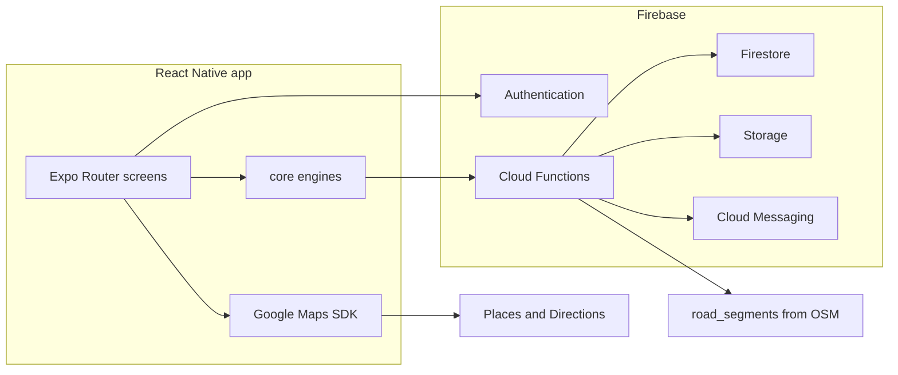
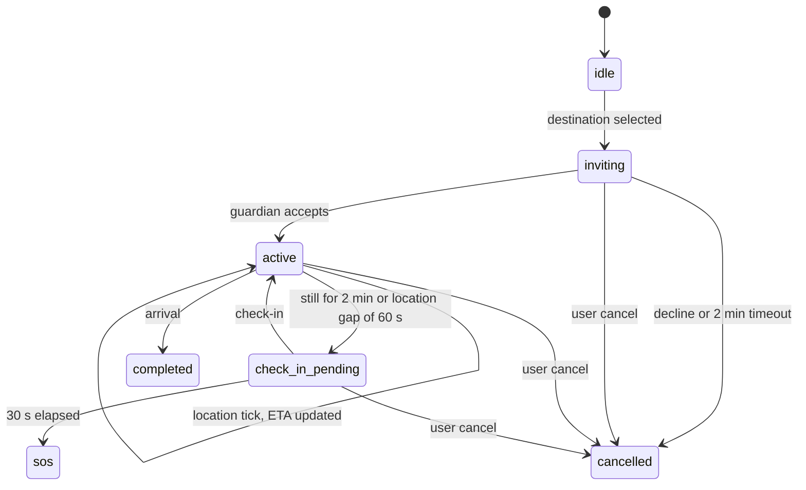

# SafeRoute 2.0 Software Requirements Specification

| Item | Value |
| --- | --- |
| Product | SafeRoute 2.0 |
| Baseline | Existing Expo app in this repository (SDK 53, version 1.0.0) |
| This revision | Extends that app. It does not replace Firebase, Google Maps, or the current screens. |
| App version | 2.0.0 |
| Runtime | Expo SDK 57.0.24, React Native 0.86.3, React 19.2.3 |
| Status | Specification plus the engines, Cloud Function source, and client wiring described below |

The beta already does the following, and 2.0 keeps it:

- Email and password sign-in through Firebase Authentication (`app/Login.tsx`, `app/Signup.tsx`, `config/firebase.ts`).
- Google Places search and Google Directions alternatives in `app/(tabs)/navigate.tsx`.
- Community reviews stored in component state, including the Bhopal sample set. Reviews are not yet read from Firestore.
- Emergency helplines on Home: 100, 101, 102, 1091, 1098, 1363, 181, 1930, 14416.
- SOS telephony target `tel:122`, now behind the hold-and-cancel flow.
- Trusted contacts in AsyncStorage under `@SafeRoute:contacts`.
- Live location sharing in `app/LiveLocationShareScreen.tsx`.

There is no trained XGBoost file in this repository. The score the app computes is the weighted formula in section 3. `applyXgbRisk` blends a published `pRisk` only when a model version is stored on the `safety_scores` document.

---

## 1. Product vision

SafeRoute 2.0 is a real-time safety navigation platform for women. At the moment a trip is requested it ranks roads with live context, community reports, and a protection session that can call for help without another decision from the user.

**Mission.** Get a woman onto the safest usable route for the conditions she is in, and keep a guardian able to intervene if that trip goes wrong.

**Problem.** General-purpose maps optimize time and distance. A shorter road can be empty, unlit, or recently reported. Category maps that only say green, yellow, or red hide the difference between a score of 41 and a score of 69, and they do not change with the hour. A panic button that dials immediately is easy to trigger by mistake and does nothing when the phone has no data.

**Target users.**

- Women planning a walking or riding trip who want a route chosen for safety as well as time.
- Guardians (a trusted contact with a SafeRoute account) who accept a live trip.
- Community members who file reports. Their influence depends on the trust score in section 6.

**Value.** The route request returns three plans — Safest, Balanced, and Fastest — from one graph search, with a 0–100 score, ETA, distance, crowd, and lighting. Safe Walk and Smart SOS are armed before something goes wrong.

**Compared with Google Maps.** Google Maps remains the geometry provider for candidate roads and turn-by-turn text. SafeRoute adds a safety-weighted cost, trust-weighted reports, a heat map, Safe Walk, and SOS with an SMS fallback. It does not reimplement the map base tiles.

**Compared with a typical safety app.** Those apps store a contact list and a panic button. SafeRoute also chooses the route, updates the score with time and reports, and escalates a silent stop during Safe Walk.

---

## 2. System architecture



| Piece | Role in 2.0 |
| --- | --- |
| React Native app | Expo Router screens already in `app/`. Engines live in `core/` and run on the device so a route can be labeled without a round trip. |
| Firebase Authentication | Unchanged email/password flow. Callable functions reject requests with no `uid`. |
| Firestore | Collections in section 12. Client writes go through rules in `firestore.rules`. Scoring writes are Admin SDK only. |
| Cloud Functions | `functions/src/index.ts`. Node 22. |
| Google Maps SDK | `react-native-maps` 1.27.2. Android key remains `EXPO_PUBLIC_GOOGLE_MAPS_API_KEY`. |
| OpenStreetMap | Loaded offline into `road_segments` (ways as edges, intersections as nodes). The phone does not download the planet file. |
| Storage | Audio and snapshot objects for an active SOS. Paths are fields on `emergencies`. |
| FCM | Guardian push from `sendGuardianNotification`. The user document stores `fcmToken`. |
| AI risk engine | Section 3. Weighted score always. XGBoost output optional. |
| Route optimization engine | Section 4. `core/routeOptimization.ts`. |
| Emergency services | Home helplines, SOS call to 122, SMS to saved contacts, guardian FCM. |

### Data flow for a route

1. The signed-in user searches with Google Places, as the beta already does.
2. The app requests Directions with alternatives, plus `avoid=highways` and `avoid=tolls`, and drops near-duplicates (0.5 km and 2 minutes).
3. Each remaining polyline is sampled every fifth point and turned into a chain of edges. A zero-length edge joins every chain to a shared source and a shared sink. Edge length is scaled to the Directions distance. Speed is chosen so the chain ETA matches the Directions duration.
4. Each edge midpoint is scored with section 3 using reviews within 200 m, the device clock, and lighting reviews whose `category` is `lighting`. Missing features stay null. They are not filled with a guessed value.
5. `generateRoutes` runs A* (safest), bidirectional A* (fastest), and Yen's K=3 (balanced).
6. The map draws the chosen polyline in the heat color of its score. The cards show Safest, Balanced, and Fastest when those searches pick different Directions results.
7. When `road_segments` exist for the origin geohash (precision 6), `generateRoutes` on the server searches that graph instead of the Directions candidate graph. The same three functions are used.

### Data flow for SOS

1. Hold for 2 seconds (`SOS_HOLD_MS`). A short hold returns to idle.
2. A 5-second countdown runs. Cancel returns to `cancelled`.
3. On expiry the phase is `active`. The app watches GPS every 5 seconds, vibrates if siren is on and silent mode is off, probes connectivity, writes SMS to the first saved contact when the network check fails, and places `tel:122`.
4. `activateSOS` writes `emergencies` and notifies guardians. The client call to that function is in `services/callables.ts`. The current SOS screen still completes the phone and SMS path if the callable is not deployed.

---

## 3. AI dynamic safety scoring engine

Score `S` is in `[0, 100]`. Higher is safer. Implementation: `core/safetyScore.ts`.

### Feature vector

Order is fixed. This is the XGBoost input vector. A null component means the feature was not observed.

| Index | Name | Raw input | Normalization to [0, 1], 1 = safer |
| --- | --- | --- | --- |
| 0 | timeOfDay | local hour in `[0, 24)` | 10:00–17:00 → 1. 17:00–21:00 → `1 - 0.55 * (h-17)/4`. 21:00–05:00 → 0.25. 05:00–10:00 → `0.25 + 0.75 * (h-5)/5` |
| 1 | dayOfWeek | 0 Sunday … 6 Saturday | Mon–Thu 0.85, Friday 0.70, Saturday 0.60, Sunday 0.75 |
| 2 | communityRating | mean stars in `[1, 5]` | `(rating - 1) / 4` |
| 3 | crowdDensity | bucket from section 7 | empty 0.20, low 0.45, moderate 0.85, high 0.70, very high 0.55 |
| 4 | streetLighting | 0 unlit … 1 lit | already in `[0, 1]` |
| 5 | weatherVisibility | kilometres | `min(1, km / 10)` |
| 6 | policeProximity | metres to nearest station | `max(0, 1 - metres/2000)` |
| 7 | cctvAvailability | 0 none … 1 verified | already in `[0, 1]` |
| 8 | verifiedIncidents | count in 30 days | `1 / (1 + count)` |
| 9 | historicalReports | decayed report count | `1 / (1 + count)` |

### Weights

These weights sum to 1:

| Feature | Weight |
| --- | --- |
| timeOfDay | 0.14 |
| dayOfWeek | 0.06 |
| communityRating | 0.22 |
| crowdDensity | 0.10 |
| streetLighting | 0.12 |
| weatherVisibility | 0.06 |
| policeProximity | 0.08 |
| cctvAvailability | 0.06 |
| verifiedIncidents | 0.10 |
| historicalReports | 0.06 |

Community reports and time of day carry the most weight because those are the signals the beta already collects and the ones that change within a day.

### Formula

Let `O` be the set of observed features. Confidence is the sum of the original weights of features in `O`:

```
confidence = Σ w_i   for i in O
```

Weights are renormalized over observed features so a missing weather reading does not pretend to be a neutral 0.5:

```
w'_i = w_i / confidence    for i in O
S_weighted = 100 * Σ w'_i * x_i
```

`S_weighted` is clamped to `[0, 100]`.

### XGBoost blend

XGBoost is the training model for tabular trip risk. It is preferred to a deep network for this product because:

- The input is ten numeric features, not an image or a long sequence.
- Verified incident labels will be scarce. Gradient-boosted trees remain usable on thousands of rows. A deep net needs much more data before it beats a tree on this table.
- Inference is a walk over a few trees, which fits a Cloud Function and a phone.
- Missing values are native to the booster. The weighted formula already drops missing features. The booster can do the same.
- Feature gain is readable, so a bad weight (for example CCTV dominating night) can be seen.
- A monotonic constraint can force `verifiedIncidents` to never increase the safe score.

The booster is trained offline on rows whose label is 1 when a verified incident occurred on that segment in the following 7 days, otherwise 0. The published artifact stores `pRisk` in `[0, 1]` and a model confidence `α` in `[0, 1]` on the `safety_scores` document. Until that field exists, `α = 0`.

```
S = (1 - α) * S_weighted + α * 100 * (1 - pRisk)
```

### Legacy label

The navigation guard that used to reject a "dangerous" route still runs. It now reads the continuous score:

- confidence below 0.30 → `unreviewed`
- score ≥ 70 → `safe`
- score ≥ 40 → `caution`
- otherwise → `dangerous`

The map does not use this label for color.

### Worked example

Inputs: 22:30, Friday, community rating 4, moderate crowd, lighting 0.7, visibility 8 km, police 800 m, CCTV 0.5, 1 verified incident, 2 historical reports, `pRisk = 0.4`, `α = 0.8`.

Normalized vector:

```
[0.25, 0.70, 0.75, 0.85, 0.70, 0.80, 0.60, 0.50, 0.50, 0.3333]
```

All ten features are present, so confidence = 1.0.

```
S_weighted = 60.7
S = 0.2 * 60.7 + 0.8 * 60 = 60.1
```

`scripts/verify-core.ts` asserts this result.

---

## 4. Intelligent route optimization

Implementation: `core/routeOptimization.ts`.

### Graph

```
G = (V, E)
```

- A node is an intersection or a sampled point: `{ id, latitude, longitude }`.
- An edge is a directed road segment: `{ id, from, to, lengthM, speedKmh, safetyScore, lighting, crowd }`.
- A two-way street is two edges. OSM `oneway` tags become one edge when segments are imported.

Directions candidates are a special case of the same graph: one chain per alternative, plus a shared source and sink. A denser OSM graph uses the same search functions with real intersection ids.

### Edge cost

`λ = 3`. `Vmax = 80 km/h` is used only by the heuristic.

```
km = lengthM / 1000
risk = (100 - safetyScore) / 100
distancePenalty = km
safetyPenalty = risk * km * λ
etaMinutes = (km / max(speedKmh, 1)) * 60

c(e) = wD * distancePenalty + wS * safetyPenalty + wT * etaMinutes
```

Mode weights `(wD, wS, wT)`:

| Mode | Distance | Safety | Time |
| --- | --- | --- | --- |
| Safest | 0.15 | 0.75 | 0.10 |
| Balanced | 0.25 | 0.40 | 0.35 |
| Fastest | 0.15 | 0.10 | 0.75 |

ETA shown to the user is `Σ etaMinutes` of the chosen edges, not the cost. On a Directions candidate, speeds are set so this sum equals the Directions duration.

### Why A*

The heuristic

```
h(n) = wD * haversineKm(n, goal) + wT * (haversineKm(n, goal) / Vmax) * 60
```

never counts safety, and safety penalties are ≥ 0. It also assumes the maximum speed, so the time term cannot exceed the true time term. The heuristic is admissible. A* therefore returns the optimal path for that mode's cost and expands fewer nodes than Dijkstra on a road network, because the geographic lower bound pulls the search toward the destination.

Dijkstra would also be optimal and would ignore the straight-line lower bound. Breadth-first search is wrong because edge costs are not uniform.

### Bidirectional A*

Used for the fastest mode, where routes are longer and a one-sided search expands more of the city.

A potential keeps the reduced costs non-negative (Pohl):

```
π(n) = (h(n, goal) - h(n, start)) / 2
c_f(u, v) = c(u, v) + π(v) - π(u)
c_b(u, v) = c(u, v) - π(v) + π(u)
```

The reverse graph is searched from the goal. The search stops when the sum of the best open reduced labels is at least the best path that has already met. If the two searches never meet, the function falls back to forward A*.

### Yen's K shortest paths

Used for the balanced mode with K = 3. The shortest-path subroutine is A* with a set of blocked edges and blocked prefix nodes, which is the standard loopless Yen procedure. The balanced card is the first of those K paths that is not identical to the safest path and not identical to the fastest path. If every path is identical, the balanced card is that single path and the UI shows one card.

### Pseudocode

```
function edgeCost(e, mode):
    w = WEIGHTS[mode]
    km = e.lengthM / 1000
    risk = (100 - clamp(e.safetyScore, 0, 100)) / 100
    return w.distance * km
         + w.safety * risk * km * LAMBDA
         + w.time * (km / max(e.speedKmh, 1)) * 60

function aStar(G, start, goal, mode, blockedEdges, blockedNodes):
    open = [(start, h(start))]
    g[start] = 0
    while open is not empty:
        u = pop min f
        if u == goal: return reconstruct
        for e in out(u):
            if e is blocked: continue
            g' = g[u] + edgeCost(e, mode)
            if g' < g[e.to]:
                g[e.to] = g'
                parent[e.to] = (u, e)
                push e.to with f = g' + h(e.to)

function generateRoutes(G, start, goal):
    safest = aStar(G, start, goal, safest)
    fastest = bidirectionalAStar(G, start, goal, fastest)
    paths = yen(G, start, goal, K=3, balanced)
    balanced = first path in paths whose nodes differ from safest and fastest
    return { safest, balanced, fastest }
```

### Checked graph

On a three-node graph, the safe corridor A→B→C (1 km, 30 km/h, score 100, twice) and the short unsafe edge A→C (0.8 km, 40 km/h, score 10):

- Safest path is A-B-C.
- Fastest path is A-C.
- Yen returns both paths.

---

## 5. Heat map

Static green / yellow / red categories are no longer the map color. `heatColor(score)` in `core/heatmap.ts` maps 0–100 onto an HSL hue from 0 (low score) to 130 (high score), saturation 78, lightness around 42–48. The polyline, review pins, and area circles use this color.

Legend stops for the scale are 0, 20, 40, 60, 80, 100. They are labels on a continuous ramp, not separate safety categories.

### Live updates

`safety_scores` documents are keyed by geohash precision 7. A viewport listener uses the prefix length from the zoom:

| latitudeDelta | Prefix length | Use |
| --- | --- | --- |
| > 0.5 | 5 | city |
| > 0.15 | 6 | district |
| > 0.04 | 7 | street |
| otherwise | 8 | block, client-side only |

The client debounces region changes by 300 ms, queries `safety_scores` where `geohash` is in the visible prefixes, and redraws. Writes that change a cell's score arrive through the Firestore listener. Tiles from Google stay as the base map. Only the overlay polylines and circles are ours.

### Zoom and clusters

Below prefix 6, cells that fall in the same parent geohash draw as one circle at the mean coordinate with the mean score. At prefix 7 and 8, individual segments draw. The overlay caps at 500 segments. Extra segments stay in memory and enter the cap as the user pans.

### Performance

- One listener per visible prefix set, not one listener per segment.
- Polylines use the sampled points already built for routing, not every OSM vertex, until the user selects a route.
- Scores are computed in the function, not on every frame.
- The phone does not recompute XGBoost. It reads `pRisk` if present and otherwise uses the weighted formula.

---

## 6. Community trust system

Implementation: `core/trust.ts`. New accounts start at 50.

### Formula

Counts are decayed before they enter the formula. A count of age `d` days contributes `0.5 ^ (d / 90)`.

```
T = clamp(50
    + 8 * accurateReports
    + 12 * verifiedReports
    + 4 * participationWeeks
    - 15 * spamReports
    - 20 * fakeReports
    - 10 * locationMismatches
    - 6 * deletedReports, 0, 100)
```

Accurate means another trusted user later confirmed the same geohash and category. Verified means a moderator or a second independent report marked the document `verified`. Participation weeks are distinct weeks with at least one accepted report.

### Levels and report weight

| Score | Level | Weight on a report |
| --- | --- | --- |
| 0–20 | untrusted | 0 |
| 21–40 | low | 0.25 |
| 41–60 | standard | 0.60 |
| 61–80 | trusted | 1.0 |
| 81–100 | guardian | 1.4 |

A worked trust case used by the verifier: 2 accurate, 1 verified, 3 participation weeks, nothing negative → `T = 90`, level guardian, weight 1.4.

### Weighted report

```
contribution = levelWeight(trustScore) * 0.5^(ageDays/90) * (verified ? 1.5 : 1)
```

The community rating on a segment is the weighted mean of star ratings, using `contribution` as the weight. An untrusted user's report adds nothing.

### Anti-spam

- At most 5 reports per user per hour (`authorIdPrivate`).
- Same geohash precision 7 and same category within 60 minutes is rejected.
- Device accuracy worse than 100 m is rejected.
- Reported point more than 200 m from the device fix is a location mismatch: the report is rejected and a `trust_logs` row of −10 is written.
- Deletes are not available to the client (`allow delete: if false` on `reports`). A moderator function marks `status = deleted` and increments `deletedReports`.
- `onReportCreated` only enqueues a notification. It does not auto-verify.

### Firestore shape for trust

`users.trustScore`, `users.trustLevel`, and `trust_logs` in section 12. `verifyReport` performs the checks above before the report document is created.

---

## 7. Anonymous crowd density

Implementation: `core/crowdDensity.ts`. Collection: `crowd_cells`. Clients cannot read or write it. Only `updateCrowdDensity` can.

### Workflow

1. While the app is in the foreground, the device may emit a ping at most every 60 seconds.
2. A ping is sent only if the user has moved at least 30 m since the last ping, or Safe Walk is active.
3. If the user has been still for 5 minutes and Safe Walk is not active, pings stop. This is the battery rule. The location watcher uses balanced accuracy, not `Accuracy.BestForNavigation`, outside Safe Walk and SOS.
4. The payload is `{ geohash, bucketStartMs }`. Geohash precision is 7 (about 150 m). `bucketStartMs` is the start of the current minute. There is no user id, no advertising id, and no raw latitude.
5. The function increments `crowd_cells/{geohash}_{bucketStartMs}.count` and sets `expiresAt` to 15 minutes after the bucket.
6. A reader sums counts for the current and previous minute in that cell and maps them:

| Count | Bucket |
| --- | --- |
| 0 | empty |
| 1–3 | low |
| 4–10 | moderate |
| 11–25 | high |
| 26+ | very high |

The safety feature for that bucket is in section 3. Moderate is the safest walking condition in this model. An empty street at night and a very dense street both score lower.

---

## 8. Safe Walk

Implementation of the state machine: `core/safeWalk.ts`. Persistence: `routes` documents written by `startSafeWalk`.

### States



Stationary means successive fixes moved less than 15 m. The first fix does not count as stationary time. Two minutes of that condition moves the session to `check_in_pending` and starts a 30-second countdown.

### What the guardian sees

`sendGuardianNotification` writes `notifications` and, if `users.fcmToken` exists, sends FCM with the session id. The guardian account must already be in `guardians` with `status = accepted` before a later SOS fans out. The invitation itself is the first notification.

### Failure handling

| Failure | Behavior |
| --- | --- |
| Guardian declines or does not answer within 2 minutes | Session `cancelled`. Tracking does not start. |
| Location permission dropped for 60 seconds during `active` | Same path as a stop: check-in, then SOS if unanswered. |
| FCM send has no token | The notification document still exists. SMS uses the contact phone on the user record when the client is online. |
| Check-in callable fails | The client keeps the countdown locally and calls `activateSOS` if it reaches zero. |
| User cancels | `cancelled`, watcher removed, guardian notified with title `Safe Walk ended`. |

### API

`POST /safe-walk/start` → `startSafeWalk`

```json
{ "destination": { "latitude": 23.2599, "longitude": 77.4126 }, "guardianUserId": "uid_guardian" }
```

```json
{ "sessionId": "routesDocId", "state": "inviting" }
```

`POST /safe-walk/checkin` → `safeWalkCheckin`

```json
{ "sessionId": "routesDocId", "ok": true }
```

```json
{ "state": "active" }
```

`ok: false` returns `{ "state": "sos" }`.

---

## 9. Smart SOS

Client machine: `core/sos.ts`. Screen: `app/(tabs)/SOS.tsx`. Server: `activateSOS`.

### Client sequence

1. Idle. Silent mode and siren vibration are switches. Silent forces siren off.
2. `PressIn` starts a 2-second hold and a heavy haptic unless silent.
3. Release before 2 seconds returns to idle.
4. At 2 seconds the phase is `countdown` for 5 seconds. The cancel button is the only action that aborts.
5. At zero the phase is `active`.
   - Siren on and not silent: repeating vibration pattern. There is no siren audio file in the repository, so the alert sound is the vibration pattern.
   - GPS watch every 5 seconds at high accuracy.
   - Connectivity probe. Failure sets the SMS fallback.
   - SMS to the first contact in `@SafeRoute:contacts` with a Google Maps link of the current fix.
   - `tel:122`, which is the number the beta already dialed, now after the countdown.
6. Upload of the emergency document retries up to 3 times. After that, or if the network type is `none`, `smsFallback` is true.

Audio recording and a front-camera snapshot are fields on the emergency (`audioPath`, `snapshotPath`). The callable stores them. The SOS screen does not record audio or take a photo in this revision because the project has no microphone or camera module and no siren asset. Those captures are the next client increment on top of this state machine, not a second design.

### Backend workflow

1. Require auth.
2. Write `emergencies` with lat, lng, geohash 7, silent flag, battery percent, network type, storage paths, optional `safeWalkId`, `state = active`, and `nextGpsAt` five seconds ahead.
3. Query `guardians` where `userId == uid`.
4. For each accepted guardian, call `sendGuardianNotification`.
5. Return `{ emergencyId, smsFallback }`.
6. Subsequent GPS posts from the client update the same emergency every 5 seconds. The document is the live track. Individual points are not a separate public feed.

Battery percent and network type are part of the request body. The screen does not yet read `expo-battery` or `expo-network`. The callable accepts null for both.

### Request

`POST /sos`

```json
{
  "latitude": 23.2599,
  "longitude": 77.4126,
  "accuracyM": 12,
  "batteryPct": 46,
  "networkType": "wifi",
  "silent": false,
  "siren": true,
  "audioPath": null,
  "snapshotPath": null,
  "safeWalkId": null
}
```

```json
{ "emergencyId": "abc", "smsFallback": false }
```

---

## 10. AI incident detection

Implementation: `core/incidentDetection.ts`. This is a threshold detector on the phone. It is not a second neural model. A finding requires two matching windows within 20 seconds before the confirmation dialog. One spike does not escalate.

| Detection | Rule |
| --- | --- |
| Sudden sprint | Previous GPS speed under 1.5 m/s and current speed over 4.5 m/s |
| Phone drop | Previous acceleration magnitude under 0.25 g and current over 3.5 g |
| Violent shaking | Gyro magnitude over 4 rad/s on at least 3 of the last 5 samples |
| Long stationary | Handled by Safe Walk (section 8), not a second timer |
| High-risk area | Current segment score under 30 |
| Unusual movement | At least three heading changes over 120 degrees inside the recent sample window |

GPS speed, accelerometer magnitude, and gyroscope magnitude are read together on each sample. A sprint uses GPS. A drop uses the accelerometer. Shaking uses the gyroscope. Heading uses GPS course. The score uses the routing engine. No single sensor opens SOS.

### Escalation

1. First finding is stored with its timestamp.
2. A second finding of the same kind within 20 seconds opens a dialog: "Are you safe?"
3. Confirm safe → clear the streak.
4. No answer for 30 seconds, or the user asks for help → enter the SOS countdown in section 9. Safe Walk already in `check_in_pending` skips the dialog and uses its own countdown.
5. High-risk area does not auto-SOS. It only opens the dialog, because a low score is common on an unreviewed block and would page guardians on every trip.

---

## 11. UI / UX

Material 3 is the React Native Paper theme in `app/_layout.tsx` (`constants/paperTheme.ts`). Brand and chrome tokens live in `constants/theme.ts` (primary `#3F5EFB`, success `#22C55E`, warning `#F59E0B`, danger `#EF4444`, background `#F8FAFC`, surface `#FFFFFF`). `constants/GlobalStyles.js` re-exports those tokens for map screens. Do not use pink brand accents. Full component and Figma specs: `docs/design-system.md`. Reusable UI: `components/design-system/`.

Type scale (Inter): display 32, headline 24, title 18, body 14–16. SOS and Safe Walk actions are at least 48 dp tall. The SOS control is 72 dp.

### Home

```
+----------------------------------+
| SafeRoute                        |
| [search field]                   |
| Current area          Score 72   |
| [ Find route ]  [ Safe Walk ]    |
| [ Report ]      [ Contacts ]     |
|            ( SOS )               |
+----------------------------------+
```

The existing Home still opens Login, helplines, live share, and the map. The score chip reads the latest `calculateSafetyScore` for the current fix. Find Route opens the Navigate tab. The large SOS control is the center tab that is already highlighted in red.

### Route screen

Map full screen. Search bar on top. Three cards in a horizontal list:

```
+------------------+
| 18 min        81 |
| Safest Route     |
| 4.2 km           |
| Safety 81        |
| Crowd 70 · Light 80 |
+------------------+
```

The badge is the integer score. Color is `heatColor`. Cards that the planner did not separate are not duplicated. Start Navigation and View Directions stay. Safe Walk starts from the selected card's destination.

### Safe Walk screen

```
Guardian: Priya
ETA 14 min
[ progress along the route ]
[ I'm safe ]
[ SOS ]
```

State copy follows the machine: inviting, on the way, check-in with the 30-second count, completed.

### Report screen

Fields: category (`lighting`, `harassment`, `crime`, `infrastructure`, `other`), severity 1–5, optional photo path, optional voice path, anonymous switch. Submit calls `verifyReport`. The existing long-press review form remains the entry from the map until this form replaces it.

### Profile

Trust score and level from section 6, badge for guardian level, count of accepted reports as the safety contribution, and the emergency contact list already on the Contacts tab.

---

## 12. Firestore database design

Indexes: `firestore.indexes.json`. Rules: `firestore.rules`.

### users

| Field | Type |
| --- | --- |
| displayName | string |
| phone | string |
| fcmToken | string |
| trustScore | number |
| trustLevel | string |
| createdAt | timestamp |

```json
{
  "displayName": "Asha",
  "phone": "+91...",
  "fcmToken": "token",
  "trustScore": 62,
  "trustLevel": "trusted"
}
```

Index: document id is the auth uid. No extra index.

### reports

| Field | Type |
| --- | --- |
| authorId | string or null (null when anonymous) |
| authorIdPrivate | string |
| anonymous | bool |
| latitude, longitude | number |
| geohash | string (precision 7) |
| category | string |
| severity | number |
| note | string |
| status | string `pending`, `verified`, `rejected`, `expired`, `deleted` |
| createdAt | timestamp |

Indexes: `(geohash, createdAt desc)`, `(authorIdPrivate, createdAt desc)`.

### road_segments

| Field | Type |
| --- | --- |
| fromNodeId, toNodeId | string |
| fromLat, fromLng, toLat, toLng | number |
| lengthM, speedKmh, safetyScore | number |
| lighting, crowd | number or null |
| geohash6 | string |

Index: `(geohash6, safetyScore)`.

### safety_scores

Document id is geohash precision 7.

| Field | Type |
| --- | --- |
| communityRating | number or null |
| crowdDensity | number or null |
| streetLighting | number or null |
| visibilityKm | number or null |
| policeDistanceM | number or null |
| cctv | number or null |
| verifiedIncidents30d | number or null |
| historicalReports | number or null |
| xgbRisk | number or null |
| xgbConfidence | number or null |
| updatedAt | timestamp |

### routes

Safe Walk sessions.

| Field | Type |
| --- | --- |
| userId | string |
| guardianUserId | string |
| destination | map `{latitude, longitude}` |
| state | string |
| etaMinutes | number or null |
| stationaryMs | number |
| createdAt | timestamp |

Index: `(userId, state)`.

### emergencies

| Field | Type |
| --- | --- |
| userId | string |
| latitude, longitude | number |
| geohash | string |
| silent | bool |
| batteryPct | number or null |
| networkType | string or null |
| audioPath, snapshotPath | string or null |
| safeWalkId | string or null |
| state | string |
| createdAt, nextGpsAt | timestamp |

### guardians

| Field | Type |
| --- | --- |
| userId | string |
| guardianUserId | string |
| status | string `pending`, `accepted` |

Index: `(userId, status)`.

### notifications

| Field | Type |
| --- | --- |
| userId | string |
| fromUserId | string |
| subjectId | string |
| title | string |
| createdAt | timestamp |

Index: `(userId, createdAt desc)`.

### trust_logs

| Field | Type |
| --- | --- |
| userId | string |
| delta | number |
| reason | string |
| createdAt | timestamp |

### crowd_cells

Not in the original collection list. It is required by section 7 because a density bucket cannot be stored on a user.

| Field | Type |
| --- | --- |
| geohash | string |
| bucketStartMs | number |
| count | number |
| expiresAt | timestamp |

Document id: `{geohash}_{bucketStartMs}`.

---

## 13. Cloud Functions

Source: `functions/src/index.ts`. Runtime Node 22. Admin SDK bypasses security rules. Clients do not.

| Function | Trigger | Behavior |
| --- | --- | --- |
| `calculateSafetyScore` | callable, auth required | Reads `safety_scores/{geohash7}` and runs the section 3 formula. |
| `generateRoutes` | callable, auth required | Loads up to 400 `road_segments` for the origin geohash prefix 6, snaps origin and destination to the nearest nodes, runs section 4. Returns an empty list when the cell has no segments. The phone then keeps using Directions candidates. |
| `verifyReport` | callable, auth required | Section 6 checks, then creates `reports`. |
| `onReportCreated` | Firestore create `reports/{id}` | Writes a `report_pending` notification. |
| `startSafeWalk` | callable | Creates `routes` in `inviting` and notifies the guardian. |
| `safeWalkCheckin` | callable | Owner only. `ok` true → `active`. `ok` false → `sos`. |
| `activateSOS` | callable | Section 9 write and guardian fan-out. |
| `sendGuardianNotification` | called by the functions above | Notification document plus FCM when a token exists. |
| `updateCrowdDensity` | HTTPS POST | Section 7 increment. No auth token. The body has no user id. |
| `expireOldReports` | schedule `every 60 minutes` | Marks reports older than 180 days `expired`, 200 per run. |

---

## 14. REST / Firebase APIs

Callables are wrapped in `services/callables.ts`. Names match the functions.

### POST /route

`generateRoutes`

Request:

```json
{
  "origin": { "latitude": 23.25, "longitude": 77.4 },
  "destination": { "latitude": 23.27, "longitude": 77.42 },
  "departAtMs": 1758700000000
}
```

Response:

```json
{
  "routes": [
    {
      "mode": "safest",
      "title": "Safest Route",
      "distanceM": 2400,
      "etaMinutes": 18,
      "safetyScore": 81.2,
      "confidence": null,
      "lighting": 0.8,
      "crowd": 0.7,
      "nodeIds": ["n1", "n2", "n3"]
    }
  ],
  "segmentCount": 120,
  "departAtMs": 1758700000000
}
```

`confidence` is null on this response because the segment document stores a score, not the feature-level confidence. The on-device scorer returns confidence per point.

### POST /report

`verifyReport`

```json
{
  "latitude": 23.265,
  "longitude": 77.408,
  "category": "lighting",
  "severity": 2,
  "note": "Unlit after the crossing",
  "anonymous": true,
  "deviceLatitude": 23.2651,
  "deviceLongitude": 77.4081,
  "accuracyM": 15
}
```

```json
{ "reportId": "r1", "accepted": true, "reason": null }
```

### GET /safety-score

`calculateSafetyScore` (callable, so it is a POST on the wire with the query in the body)

```json
{
  "latitude": 23.2599,
  "longitude": 77.4126,
  "departAtMs": 1758700000000
}
```

```json
{
  "score": 60.7,
  "confidence": 0.42,
  "geohash": "ttr9abc",
  "modelApplied": false
}
```

The geohash above is illustrative. `encodeGeohash` produces a 7-character string. The score depends on the stored features for that cell.

### POST /safe-walk/start and POST /safe-walk/checkin

Section 8.

### POST /sos

Section 9.

---

## 15. Security and privacy

- Authentication is required for every callable except `updateCrowdDensity`, which accepts only a geohash and a minute bucket.
- Anonymous reports store `authorId` as null. `authorIdPrivate` remains for rate limits and is not readable by other clients. Rules allow signed-in users to read reports. A later rules change can hide `authorIdPrivate` by splitting it into a private subcollection. This revision keeps it on the report so the rate-limit query has an index.
- Location used for routing is the device fix. Crowd pings never store that fix.
- SOS audio and snapshots, when a later build uploads them, live in Storage under `emergencies/{id}/` and are readable only by the owner and the guardian accounts on that emergency. Retention is 7 days, then a scheduled delete. The field on the document is cleared with the object.
- Guardian access is an explicit `guardians` document. A contact in AsyncStorage is not a guardian.
- Consent: location permission is the existing Expo location prompt. Safe Walk and SOS are separate user actions. Crowd pings run only in the foreground under the rules in section 7.
- Report retention: `expireOldReports` at 180 days.
- Account deletion removes `users`, `guardians` where the user is either party, `routes`, `emergencies`, and `trust_logs` for that uid. Reports keep `authorIdPrivate` cleared and `anonymous` true so the map history remains without an identity.
- The rules file denies client writes to `emergencies`, `notifications`, `trust_logs`, `safety_scores`, `road_segments`, and `crowd_cells`.

This follows the GDPR ideas of purpose limitation, data minimization, and a defined retention period. It is not a certification.

---

## 16. Scalability

From about 1,000 users to about 1,000,000.

- **Indexes.** Every query in section 13 has a composite index. Geohash equality avoids geo range scans across the whole collection.
- **Geo queries.** One cell at precision 6 is the routing window (a few hundred segments, capped at 400). Precision 7 is the score and crowd cell. The client never queries "all reports near me" without a geohash prefix.
- **Functions.** Route search is bounded by the 400-segment cap. Report expiry is batched at 200. Crowd increments are a single `FieldValue.increment` so they do not read-modify-write.
- **Caching.** `safety_scores` is the cache. The phone does not recompute a cell from raw reports on every pan. A writer updates the cell when a report is verified.
- **Rate limiting.** Five reports an hour per user. SOS callables should be limited to 3 starts an hour per uid at the function (the client countdown already blocks double taps).
- **Cost.** Firestore reads dominate. Viewport listeners use prefix documents, not segment listeners. Directions calls stay as they are in the beta (three calls per search). OSM segments are stored once, not fetched from Overpass on each trip.
- **Crowd documents.** Fifteen-minute expiry keeps `crowd_cells` from growing with all-time history. A TTL policy on `expiresAt` deletes them.

At one million users the split that matters is: interactive work (score, SOS, Safe Walk) stays in functions and Firestore; booster training stays offline and only publishes `xgbRisk` onto `safety_scores`.

---

## 17. Technology stack

| Technology | Why it stays or why it was added |
| --- | --- |
| React Native 0.86.3 / Expo SDK 57 | The existing app. SDK 57 is the current stable SDK. SDK 58 was still a beta on 24 September 2026 and was not used. |
| Expo Router 57 | File-based navigation already in the project. SDK 56+ requires `@react-navigation/*` imports in app code to move to `expo-router/react-navigation` and `expo-router/js-tabs`. That move is done. |
| React Native Paper | Material 3 components already on Login, Contacts, and SOS. |
| Firebase JS SDK 12.19 | Auth, and now Firestore, Functions, and Storage from the same app object. |
| Cloud Functions (`firebase-functions` 7.4, `firebase-admin` 14.5) | The backend the beta described but did not contain. |
| FCM | Guardian pushes. Already the intended notification channel. |
| Google Maps / Places / Directions | Existing map, search, and candidate geometry. |
| OpenStreetMap via `road_segments` | Intersection graph for section 4 when a cell is loaded. Not a live Overpass dependency. |
| Geohash in `core/geohash.ts` | Precision selection for scores and crowd cells. A separate GeoFirestore package is unnecessary because the queries are prefix equality on a string field. |
| Turf.js | Not added. Distances use the haversine already in `core/routeOptimization.ts`. Adding Turf would duplicate that. |
| XGBoost | Training-time model described in section 3. No runtime package is installed, because there is no model artifact to execute. |
| `react-native-reanimated` 4.5.1 and `react-native-worklets` | Required by SDK 57. |
| `react-native-maps` 1.27.2 | The maps version Expo SDK 57 expects. |

Removed from `app.json` because SDK 57 rejects them: `newArchEnabled` (new architecture is always on) and `android.edgeToEdgeEnabled`. The location permission string now sits on the `expo-location` plugin. It was previously nested under the splash plugin, where it had no effect.

---

## 18. Future roadmap

### MVP — this revision

Done in the repository:

- Continuous score, heat colors, and Safest / Balanced / Fastest labels on the existing Directions flow.
- A*, bidirectional A*, and Yen on the shared graph type.
- Trust math, crowd ping rules, Safe Walk machine, SOS hold/cancel/SMS/`tel:122`.
- Firestore rules, indexes, and Cloud Function source.
- Dependency move from Expo SDK 53 to SDK 57.

Still local, not yet backed by a deployed Firebase project:

- Reviews in `navigate.tsx` are still the in-memory Bhopal sample plus reviews submitted in the session.
- Safe Walk and incident confirmation do not yet have their own screens. The machines and the callables are in place.
- Audio and camera capture are request fields, not a recording implementation.

### Version 2.0 — next build, about 8 weeks

Priority order:

1. Deploy functions and load `road_segments` for one city.
2. Persist reports through `verifyReport` and show the heat overlay from `safety_scores`.
3. Safe Walk screen on the route card, including the check-in countdown.
4. Incident dialog wired to the sensor sampler.
5. SOS audio upload and optional front snapshot, with the 7-day Storage deletion.

### Version 3.0 — following quarter

1. Publish the first XGBoost model onto `safety_scores.xgbRisk` after there is a verified-incident table.
2. Guardian accept/decline UI.
3. Weather visibility from a forecast field on the score document.
4. Police-station distance from a maintained POI set, not from a live Places call on every edge.

Training the booster before the verified-incident table exists would invent a model. That step waits on real `reports` with `status = verified`.
